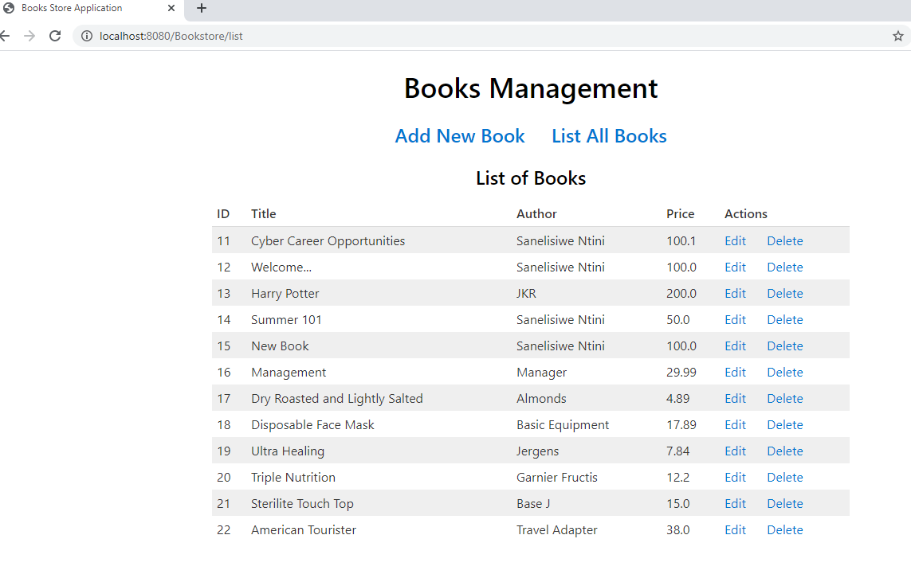
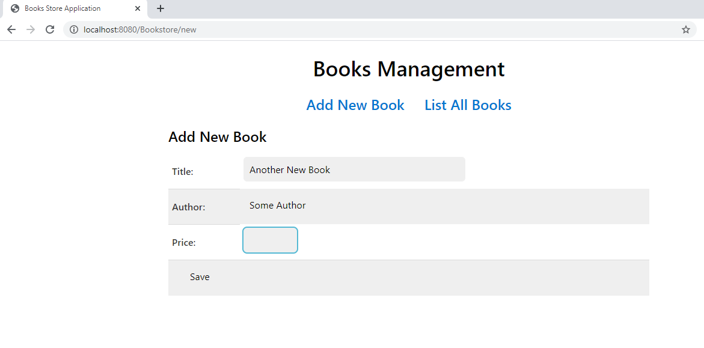
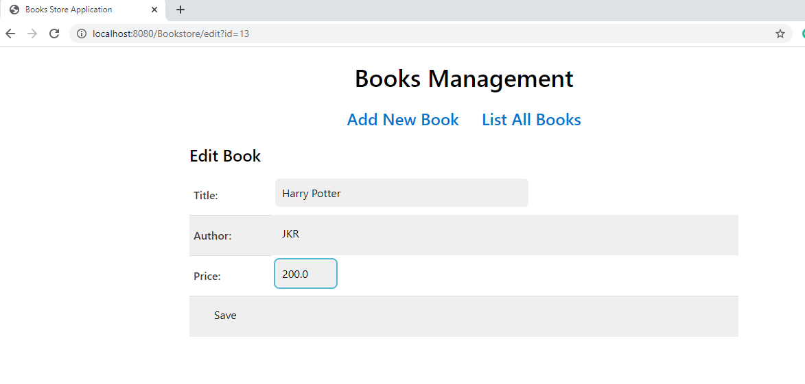

# bookstore
A basic CRUD app I made ages ago.

# Run the app
1. Run sql/Bookstore.sql with root user.
2. Clone the project.
3. Set Tomcat server.
4. Run the app in your web browser.

# Screenshots

## List (Read)

## Create

## Update

